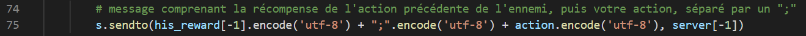
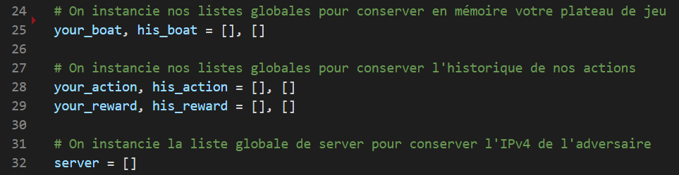
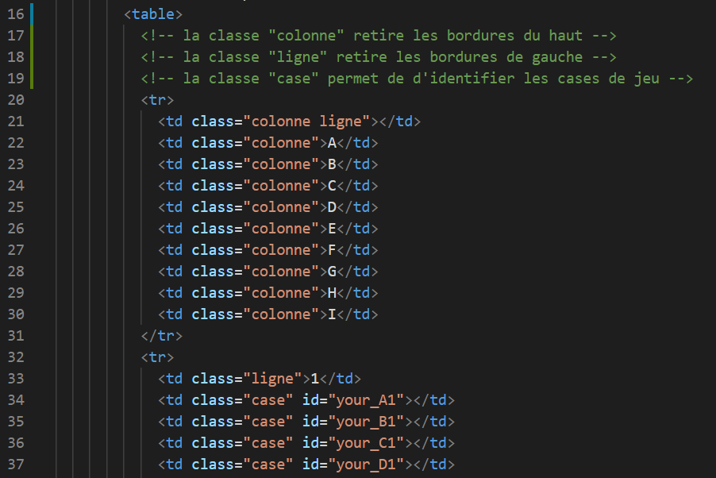
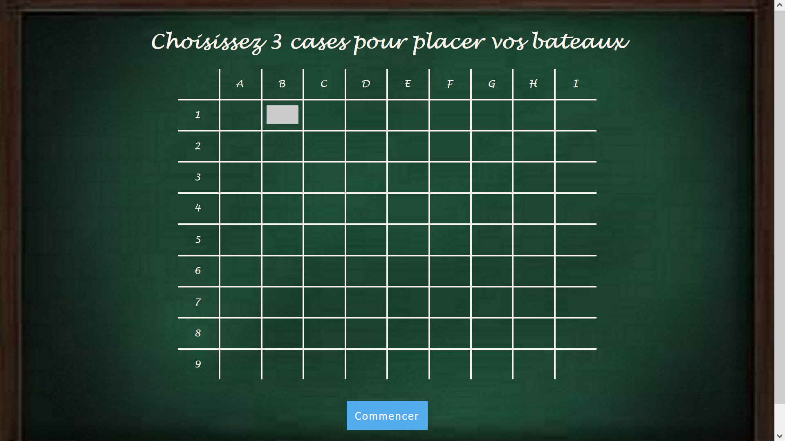
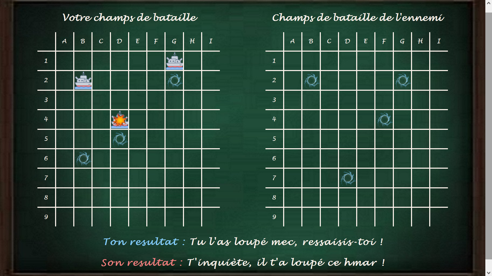
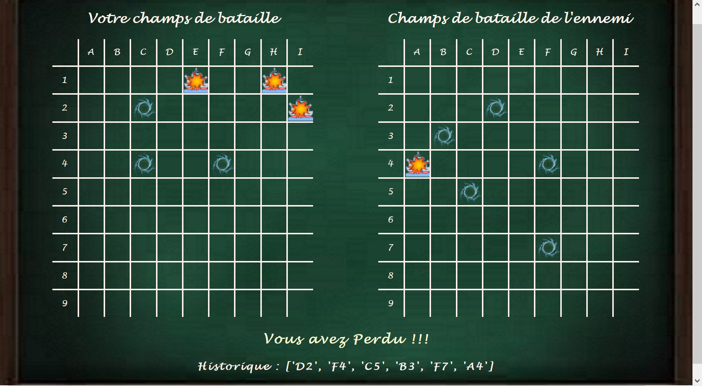

# Battleship

# 1. Pré-requis

## Installation des librairies

Assurez-vous que ces librairies soient bien installées dans votre environnement Python :

* Flask
* Socket
* Numpy

## Jouer en local

Le **Joueur** devra run le fichier "app_j2.py" dans un **premier terminal**.

Le **Joueur** devra écrire host dans la première valeur du tuple, à la ligne 33 du fichier "app_j1.py".

    33. server.append((host, 4000))

et le run dans un **autre terminal**.

## Connecter 2 PC

Il faut que les 2 PC soient sur le même réseau WI-FI.

Le **Joueur n°2** devra run le fichier "app_j2.py" et jouera le rôle de **'Serveur'**.

Le **Joueur n°1** devra écrire l'IPv4 du PC **'Serveur'** (**J2**) dans la première valeur du tuple, à la ligne 33 du fichier "app_j1.py".

    33. server.append(("192.168.137.1", 4000))

et le run. Il jouera ainsi le rôle de **'Client'**.

PS : si des problèmes de connexion vous trouble, essayer de tester votre connexion avec les fichiers **"Client.py"** et **"Server.py"** dans le dossier **"test_server"**. 
C'est une version allégée de la communication qui vous permettra de vous assurer que la connexion est possible.

# 2. Backend

## Essence du projet

Le python est le langage du futur, avec ces nombreuses librairies il permet de faire tout ce que les autres langages font, mais en mieux !

Ainsi j'ai voulu créer un jeu qui pouvait lier **python**, les enjeux du **réseau** et les possibilités qu'offrent les **Interfaces Homme-Machine**.

Le challenge de ce projet était donc de comprendre et utiliser pleinement les librairies **Flask** et **Socket**.

Un jeu tel que la **Bataille Navale** était idéal pour lier ces concepts !

## Conception du jeu

Chaque joueur à un fichier python qui lui est propre pour s'authentifier en temps que **'Server'** ou **'Client'** lors du premier tour (respectivement **J2** et **J1**). 
A chaque nouveau tour, les rôles s'inverseront (le **'Server'** deviendra **'Client'** et le **'Client'** deviendra **'Server'**).

Le **'Client'** envoie au **'Server'** un message qui sera composé de 2 informations séparées par un ";" :

* la récompense de l'action de l'ennemi
* la cible que vous avez séléctionnée (ou "Fin" si la partie est finie par la destruction de tous vos bateaux)

## Astuce pour conserver l'historique

Pour que, à chaque chargement de page, les variables permettant de suivre le déroulé de la partie puissent être conservées, elles ont été gelées en **listes globales**.

Ainsi chaque valeur de ces listes corresponde entre elles (la liste des actions contient autant de valeur que la liste des récompenses, et les dernières valeurs correspondent aux dernières actions).

## Arborescence du HTML

A contrario des fichiers python qui sont **distincts** (axe d'amélioration du projet), les 2 joueurs se partagent les **mêmes pages HTML, CSS et JavaScript**, qui s'adapteront en fonction du joueur concerné.

Chaque cellule des champs de bataille possède 1 classe entre :
* **"colonne"**
* **"ligne"**
* **"case"**
* ou les 2 classes **"colonne ligne"**

-> Ces **classes** aident le CSS à limiter le nombre de bordure des colonnes et des lignes, et permettre de pointer les cases de jeu comme cibles potentielles.

Chaque cellule de classe **"case"** possède 1 id:
* commençant par :
    * **"your_"** pour votre champ de bataille (cases non ciblables)
    * **"his_"** pour le champ de bataille de l'ennemi (cases ciblables)
* finissant par la position de la cellule (exemple : **"A1"** pour la ligne 1 de la colonne 1)

-> Ces **id** aident le CSS à ajouter les images de bateaux, de collision ou de loupé aux différentes cases qui perdent donc leur statut de cible potentielle.

# 3. Frontend

## Direction Artistique

Pour un jeu de bataille navale, je suis parti sur un esprit **nostalgique** du jeu.
Autrement dit, j'ai fait en sorte que les joueurs retombent en enfance, comme lorsqu'on jouait sur notre ardoise en craie avec notre voisin de table quand la maitresse avait le dos tourné.

## Page d'accueil

**Page de code : "init.html"** (ne pas hésiter à aller voir le code pour y voir les commentaires)

Le joueur doit choisir **3 cases** pour y placer des bateaux, pas moins, pas plus, sinon un pop-up signalera que vous n'avez pas bien répondu à la consigne.

## Page de jeu

**Page de code : "index.html"** (ne pas hésiter à aller voir le code pour y voir les commentaires)

Elle se divise en 3 parties :

* **A gauche** : Votre champ de bataille, vous y retrouverez les bateaux que vous aviez placés plus tôt, ainsi que les essais de votre adversaire.

* **A droite** : Le champ de bataille de l'ennemi, vous y retrouverez vos essais, ainsi que les bateaux de l'adversaire que vous avez touchés.

* **En bas** : Votre résultat après coup, ainsi que le résultat de votre adversaire.

## Fin de partie

Si l'un des 2 joueurs à réussi à couler tous les bateaux de l'adversaire, un pop-up vous signalera que la partie est terminée.

En bas de la page sera écrit votre résultat, ainsi que l'historique de votre partie.

# 4. A vous de jouer...

Amusez-vous bien 😃