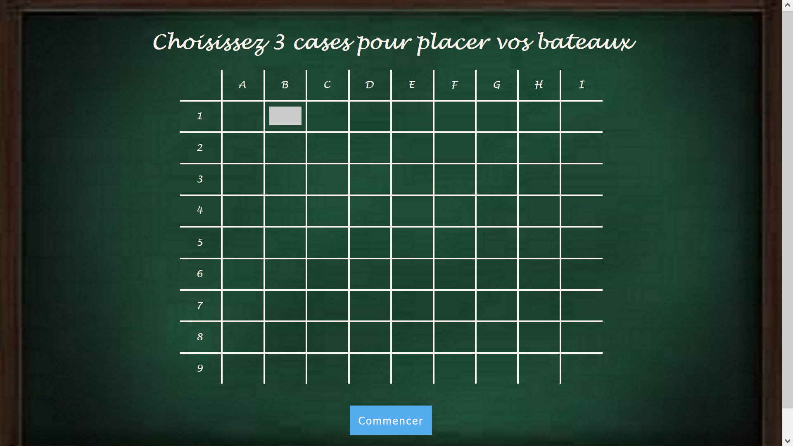
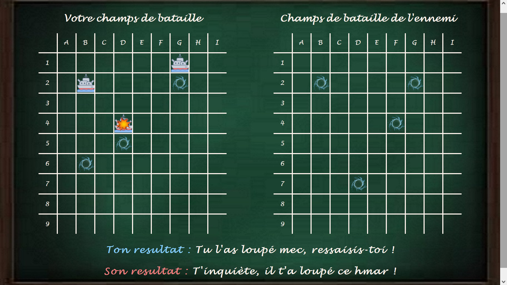

# Battleship

# 1. Pré-requis

## Installation des librairies

Assurez-vous que ces librairies soient bien installées dans votre environnement Python :

* flask
* socket
* numpy
* pandas

## Connecter 2 PC

Il faut que les 2 PC soient sur le même réseau WI-FI.

Le joueur n°2 devra run le fichier "app_j2.py" et jouera le rôle de 'Serveur'.

Le joueur n°1 devra écrire l'IPv4 du PC 'Serveur' (joueur 2) dans la première valeur du premier tuple de la liste nommé "server" dans le fichier "app_j1.py" 

    server.append(("192.168.137.1", 4000))

et le run. Il jouera ainsi le rôle de 'Client'.

## Jouer en local

Le joueur devra run le fichier "app_j2.py" dans un premier terminal.

Le joueur devra écrire host dans la première valeur du premier tuple de la liste nommé "server" dans le fichier "app_j1.py" 

    server.append((host, 4000))

et le run dans un autre terminal.

# 2. Backend

## Essence du projet

Le python est le langage du futur, avec ces nombreuses librairies il permet de faire tous ce que les autres langages font, mais en mieux !
Ainsi j'ai voulu créer un jeu qui pouvait lier python, les enjeux du réseau et les possibilités d'interface Homme-Machine.

Le challenge de ce projet était donc de comprendre et de pouvoir utiliser pleinement les librairies Flask et Socket.

Un jeu tel que la bataille navale est idéal pour lier ces concepts.

## Conception du jeu

Chaque joueur à un fichier python qui lui est propre pour s'authentifier en temps que 'Server' ou 'Client' lors du premier tour. A chaque nouveau tour, les rôles s'inverseront (le 'Server deviendra 'Client' et le 'Client' deviendra 'Server').

En revanche les 2 joueurs se partagent les mêmes pages HTML, qui s'adapteront en fonction du joueur concerné.

Le 'Client' envoie au 'Server' un message qui sera composé de 2 informations séparé par un ";" :
* la récompense de votre action précédente
* l'action présente de votre adversaire (ou "Fin" si la partie est fini par la destruction de tous vos bateaux)

Pour que, à chaque chargement de page, les variables puissent être conservées, elles ont été gélées en **liste global**. Ainsi chaque valeur de ces listes correspondent entre elles (la liste des actions contiennent autant de valeur que la liste des récompenses, et les dernières valeurs  correspondent au dernières actions).

# 3. Frontend

## Direction Artistique

Pour un jeu de bataille navale, je suis parti sur un esprit nostalgique du jeu.
Autrement dit, j'ai fais en sorte que les joueurs retombent en enfance,quand on jouait sur notre ardoise en craie avec notre voisin de table quand la maitresse se retournait pour écrire au tableau.

## Page d'accueil

Page de code : "init.html" (ne pas hesiter à aller voir le code pour y voir les commentaires)

Le joueur doit choisir 3 cases pour y placer des bateaux, pas moins, pas plus, sinon un pop-up signalera que vous n'avez pas bien répondu à la consigne.

## Page de jeu

Page de code : "index.html" (ne pas hesiter à aller voir le code pour y voir les commentaires)

Il se divise en 3 partie :

* A gauche : Votre champs de bataille, vous y retrouverez les bateaux que vous aviez placés plus tôt, ainsi que les essais de votre adversaire.

* A droite : Le champs de bataille de l'ennemi, vous y retrouverez vos essais ainsi que les bateaux de l'adversaire que vous avez touchés.

* En bas : Votre résultat après coup, ainsi que le résultat de votre adversaire.

## Fin de partie

Si l'un des 2 joueurs à réussi à couler tous les bateaux de l'adversaire, un pop-up vous signalera que la partie est terminée, votre résultat, ainsi que l'historique de votre partie.

